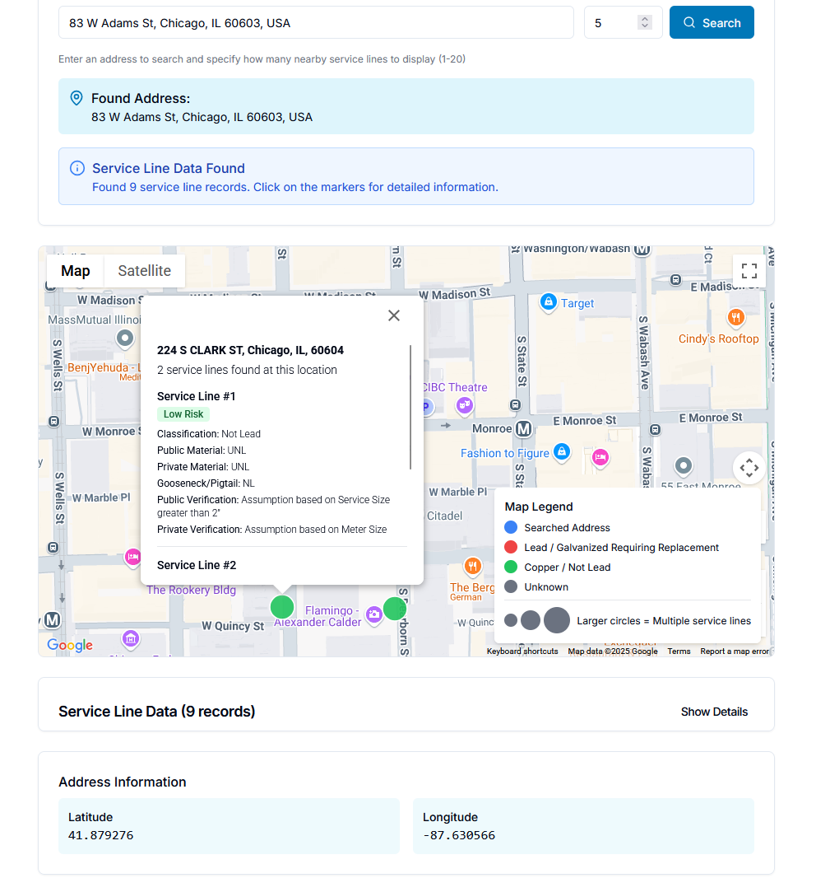
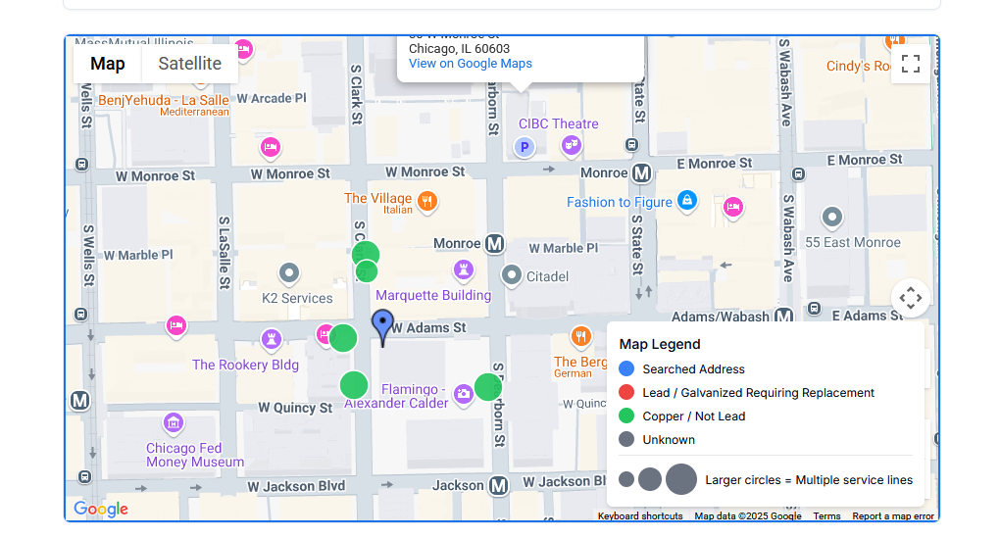
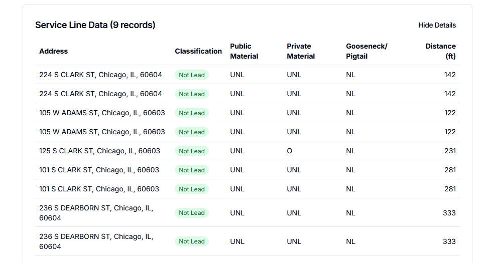

This project provides an API for identifying the nearest water service lines in Chicago and assessing their material composition with a specific focus on highlighting the presence of lead, galvanized, or unknown service lines.

Chicago has more than 400,000 lead service lines, more than any other city in the U.S., posing a long-standing public health and equity concern. While the City of Chicago provides a service line lookup tool at sli.chicagowaterquality.org,
its functionality is limited, and its user experience is not intuitive, especially when an address is not directly matched or geocoded.

This API powers a frontend that:

  Accepts a latitude and longitude

  Returns the k-nearest unique addresses with known service line data

  For each address, returns:

      address

      public_material (PWS-owned)

      private_material (customer side)

      classification of the entire service line

      distance in feet from the queried location

      Location of each line (lat/lon)

      
For an example check out: https://82-below.vercel.app/check-my-address (API search and map functionality down, No $. Also disconnected google API for similar reasons)

